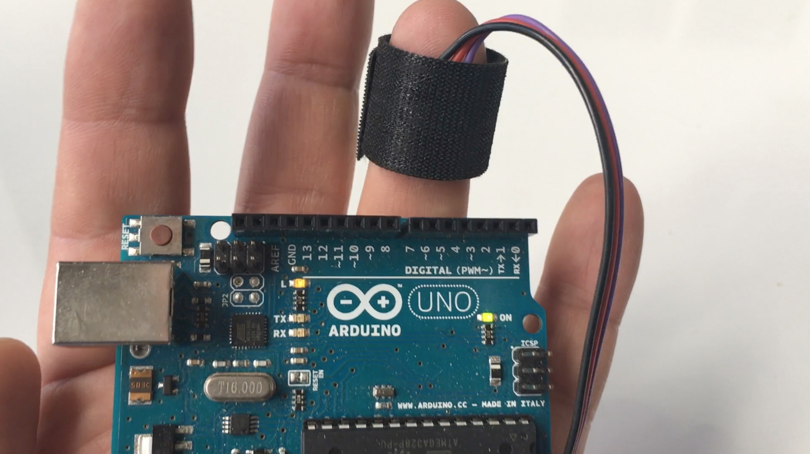
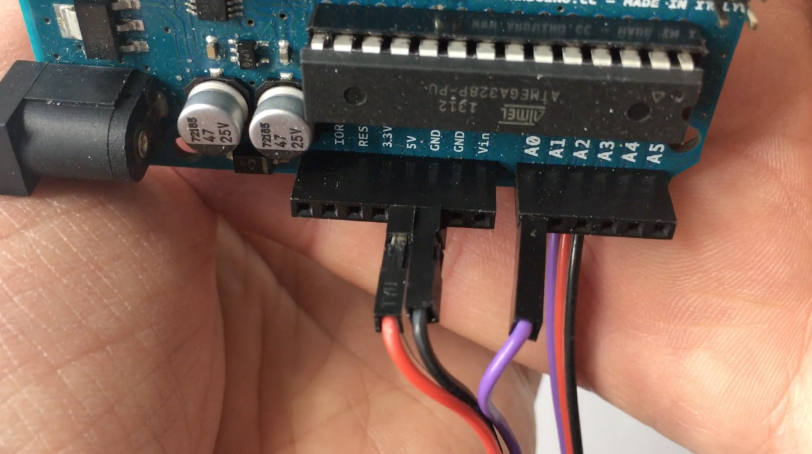

# PulseSensor  StarterProject
#### The Best Way to Get Started with your PulseSensor & Arduino. Requires one Arduino and one PulseSensor.  "Human-readable" code that is newbie freindly.

#### *  Blink an LED (on Pin 13) with your heartbeat!  💓

#### * Live visualization of Raw Pulse Signal in Arduino's cool "Serial Plotter".

#### *  A great first-step in troubleshooting your circuit and connections. 

* Arduino <a href="http://arduino.cc/"> "Arduino"</a>

legal:  PulseSensor.com is at Trademark of World Famous Electronics llc. in Brooklyn, NY. 
