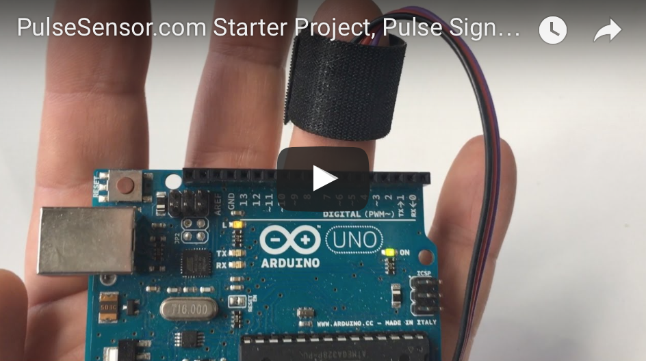

## Donation
If this project help you reduce time and complexity in your project.  Send use some paypal love. 

## Getting Started Code / <a href="http://www.pulsesensor.com">PulseSensor</a>  & <a href="http://arduino.cc/"> "Arduino"</a>

---------------------------------------------------------------------------------

* Newbie-friendly code.   
* Live visualization of Raw Pulse Signal in Arduino's cool "Serial Plotter".

* Blink an LED (on Pin 13) with your heartbeat!  💓

* A great first-step in troubleshooting your circuit, connections, and project!

--------------------------------------------------------
Legal:  PulseSensor.com™ World Famous Electronics llc. in Brooklyn, NY. USA
